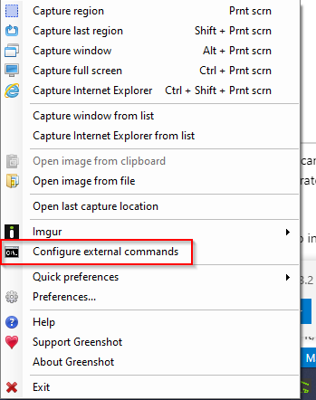
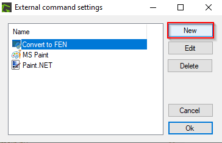
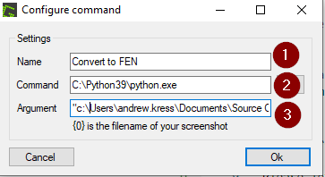
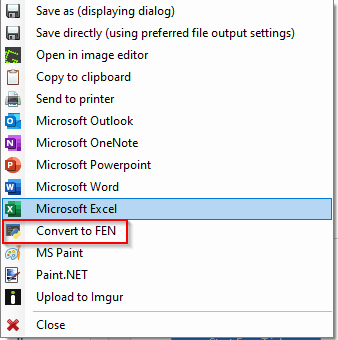

**Chessputzer Greenshot** recognizes chess positions. This fork is for use as a [Greenshot](https://getgreenshot.org) plugin in order to automatically take a screenshot and put the corresponding FEN in your clipboard.  It has been updated to use with Python 3.

For best results, include the border of the chessboard and crop close to it. If parts of the diagram are blurry and harder to decipher, the algorithm makes the best guess based on other pieces on the board. 

**Note**: the program is intended for fonts that usually appear in print. Images created by chess software might not work. 

Please let me know if you have examples of books and images that cause problems.

Have fun!

----

**Installation Instructions**

1. Install [Python 3](https://www.python.org/downloads/)

2. Download [code](https://github.com/andrewkress/chessputzer/releases/)

3. Install dependencies
* Run the included install_requirements.bat as administrator

4. Install [Greenshot](https://getgreenshot.org)

5. Configure Greenshot

* Configure External Command:

* Create new command

* Assure settings are correct

1. Name you want in the menu
2. Path to python that you installed such as C:\Python39\python.exe
3. Argument to call the script to convert the image to FEN. Copy exactly as below if you downloaded into your Documents.  Adjust this as necessary
4. "c:\Users\andrew.kress\Documents\chessputzer\putzmain.py" -f "{0}"

* Test that the board image is converted properly to FEN

----

**Chessputzer** was inspired by [Fenbot](https://github.com/Elucidation/tensorflow_chessbot) but the internals are quite different. It is designed for scanned images using popular fonts, with plenty  of noise and artifacts.  Our aim is to do less, but tolerate more. 

**How it works**

1. [Cropping and Cutting](Splitting-up-the-board.ipynb) where we detect the boundary of the chessboard and split it up into 64 squares.

2. [Filtering and Matching](Matching-and-Filtering.ipynb) where we rediscover the ancient technique of template matching. And spend many happy hours removing the stripes from the dark squares. 

3. *Error correction* where we admit that the board probably does not have six knights on it, and make the best guess.

4. [Deep Learning](Going-nuclear-deep-learning.ipynb) where we turn to the twenty-first century [alchemists](<https://youtu.be/Qi1Yry33TQE?t=745>).

